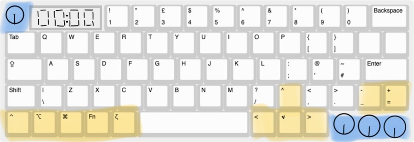
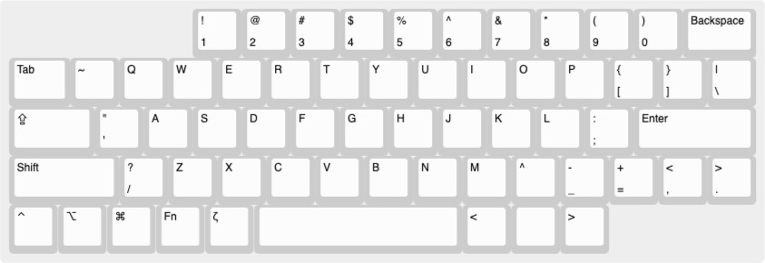
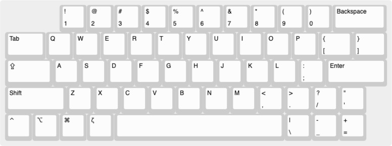

## 4th of June: Ideation.
I'm honestly so hyped for this project and today was all about spending some time consolidating this hype into actual features to implement onto a keyboard. After watching a bunch of long Youtube videos on the topic, notably Christian Selig's ["I Built My Dream Keyboard from Absolute Scratch"](https://www.youtube.com/watch?v=7UXsD7nSfDY&t=1179s) and Modern Hobbyist's underrated ["I Built My DREAM Keyboard from SCRATCH (and it's modular)"](https://www.youtube.com/watch?v=KwFWBdfZKnI), I had a good idea of things I wanted in my keyboard, what I really did not want and also some pretty clever tools I can use in the process.

So in terms of layout and size, I've decided to stick to a QWERTY layout (boring, I know, but I use my laptop keyboard a ton and don't want to learn the ins and outs of a completely custom layout) on a 65%-ish keyboard. In the Zetaboard, I want to do away with some of the keys I've basically never used, or intend to in the future. And, to increase productivity, I'm going to be integrating a Pomodoro timer into the keyboard. TL;DR, these are my main features:

- Hot swappable MX switches
- 65% + a few knobs (get rid of never-used keys)
- Inbuilt pomodoro timer (special key and layer for it)
- RGB, or some form of backlighting
- Wireless
- Vertically tilted slightly, so that each key is slightly above the one below (ergonomics)

I got into Keyboard Layout Editor, to do up a quick visual of what I have in mind. It'll look something like this.

I've added a special Zeta key which will used to trigger a layer for the Pomodoro timer and other keyboard related actions.

I've gotta start looking for some parts now...

**Total time spent:** 3h

## 5th of June: Part Sourcing.
This morning, I showed my design to a friend, and he made some suggestions which I've added into my KLE design;

I've basically just shifted some keys around to make sure the main letter keys are centered and the other keys go around, while still leaving space for the rotary encoders and Pomodoro timer.

In total, I've got 61 keys, and the Capslock, Enter, Shift and Space keys will need stabilisers - not too sure how to implement in the PCB, but we'll cross that bridge when we get there...

I'm also not too sure about the MCU I'm going to use - from what I've heard, Nice!Nano is pretty good, but there's one small problem; it only has 21 GPIO pins, and I need a good amount more, for my 7-segment display and rotary encoders (I'll be having 4 of those in total).

## 7th of June: Still on the design.
After asking around on Slack and doing my own research, I really started questioning the feasibility of the keyboard I've designed so far. I had completely forgot to account for how many pins I'd be using and the actual size of the keycaps; for some reason, my current design features keys of really weird lengths (like a 4.25u spacebar instead of the standard 6.25u). I've hence decided to completely start from scratch on the design of the keyboard, with two main aims in mind;

1. Don't stray too far away from the conventional layout (I don't want to have to adapt to a weird custom layout I won't use anywhere else.)

2. Try to maximise functionality within a smaller amount of keys/rotary encoders (eg. instead of 4 encoders, use 2)

So, with these two goals in mind, here's my improved design.

This design makes sure I have all essentials and while it doesn't have the arrow keys, it allows me to leave space in the top left corner for a seven segment display (the TM1637) and two rotary encoders on the bottom right.

In total, without implementing any optimised arrangments in my schematic, I'll need the following amount of GPIO pins;

- 18 pins for the switch matrix (5*13)
- 2 for TM1637
- 4 for EC11 encoders (I'll wire the switch parts into the switch matrix)
- 1 for neopixel for RGB

Total: 25

Luckily, the Raspberry Pi Pico 2W has 26 GPIO pins, and would leave one spare if I were to use it for my keyboard.

And my keyboard will also have a total of 56 keys - which means 56 switches.