## 4th of June: Ideation.
I'm honestly so hyped for this project and today was all about spending some time consolidating this hype into actual features to implement onto a keyboard. After watching a bunch of long Youtube videos on the topic, notably Christian Selig's ["I Built My Dream Keyboard from Absolute Scratch"](https://www.youtube.com/watch?v=7UXsD7nSfDY&t=1179s) and Modern Hobbyist's underrated ["I Built My DREAM Keyboard from SCRATCH (and it's modular)"](https://www.youtube.com/watch?v=KwFWBdfZKnI), I had a good idea of things I wanted in my keyboard, what I really did not want and also some pretty clever tools I can use in the process.

So in terms of layout and size, I've decided to stick to a QWERTY layout (boring, I know, but I use my laptop keyboard a ton and don't want to learn the ins and outs of a completely custom layout) on a 65%-ish keyboard. In the Zetaboard, I want to do away with some of the keys I've basically never used, or intend to in the future. And, to increase productivity, I'm going to be integrating a Pomodoro timer into the keyboard. TL;DR, these are my main features:

- Hot swappable MX switches
- 65% + a few knobs (get rid of never-used keys)
- Inbuilt pomodoro timer (special key and layer for it)
- RGB, or some form of backlighting
- Wireless
- Vertically tilted slightly, so that each key is slightly above the one below (ergonomics)

I got into Keyboard Layout Editor, to do up a quick visual of what I have in mind. It'll look something like this.

I've added a special Zeta key which will used to trigger a layer for the Pomodoro timer and other keyboard related actions.

I've gotta start looking for some parts now...

**Total time spent:** 3h

## 5th of June: Part Sourcing.
This morning, I showed my design to a friend, and he made some suggestions which I've added into my KLE design;

I've basically just shifted some keys around to make sure the main letter keys are centered and the other keys go around, while still leaving space for the rotary encoders and Pomodoro timer.

In total, I've got 61 keys, and the Capslock, Enter, Shift and Space keys will need stabilisers - not too sure how to implement in the PCB, but we'll cross that bridge when we get there...

I'm also not too sure about the MCU I'm going to use - from what I've heard, Nice!Nano is pretty good, but there's one small problem; it only has 21 GPIO pins, and I need a good amount more, for my 7-segment display and rotary encoders (I'll be having 4 of those in total).

**Total time spent:** 2h

## 7th of June: Still on the design.
After asking around on Slack and doing my own research, I really started questioning the feasibility of the keyboard I've designed so far. I had completely forgot to account for how many pins I'd be using and the actual size of the keycaps; for some reason, my current design features keys of really weird lengths (like a 4.25u spacebar instead of the standard 6.25u). I've hence decided to completely start from scratch on the design of the keyboard, with two main aims in mind;

1. Don't stray too far away from the conventional layout (I don't want to have to adapt to a weird custom layout I won't use anywhere else.)

2. Try to maximise functionality within a smaller amount of keys/rotary encoders (eg. instead of 4 encoders, use 2)

So, with these two goals in mind, here's my improved design.

This design makes sure I have all essentials and while it doesn't have the arrow keys, it allows me to leave space in the top left corner for a seven segment display (the TM1637) and two rotary encoders on the bottom right.

In total, without implementing any optimised arrangments in my schematic, I'll need the following amount of GPIO pins;

- 18 pins for the switch matrix (5*13)
- 2 for TM1637
- 4 for EC11 encoders (I'll wire the switch parts into the switch matrix)
- 1 for neopixel for RGB

Total: 25

Luckily, the Raspberry Pi Pico 2W has 26 GPIO pins, and would leave one spare if I were to use it for my keyboard.

And my keyboard will also have a total of 56 keys - which means 56 switches.

**Total time spent:** 3h

## 8th of June: Starting the schematic.
I've basically almost finished my BOM, and the only parts I don't have on it yet are the PCB, and the switch stabilisers, which I'll decide on once I'm further into the project.

Most of the schematic was very repetitive, as I had to wire up my keyboard matrix first, and then another massive bundle of SK6812 neopixel LEDs.

My keyboard matrix (with the rotary encoder switches as I had talked about before):

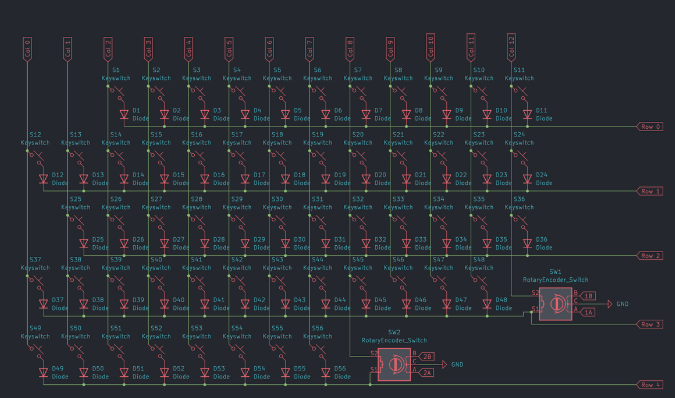

The neopixel matrix so far;

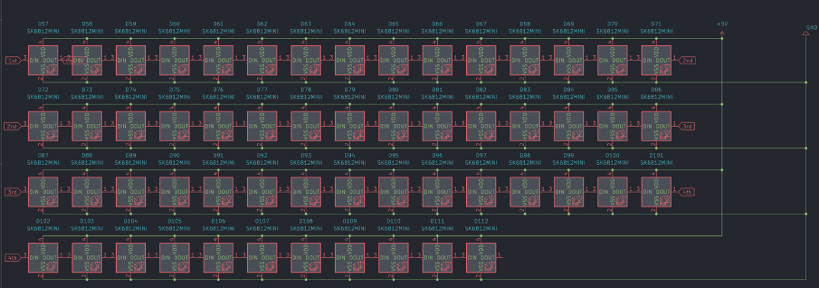

Since I want to use the TM1637 display module and not just the display with a TON of pins - I had to make my own symbol for it and I found that easier than expected.

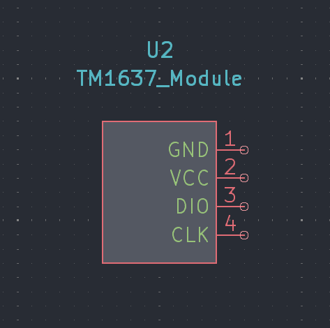

I put up my schematic for review on Slack and got some feedback about the neopixel wiring - I'll work on that tommorow. The only other part I've really got left is the Pimroni LiPo Shim for the Pico - I'll probably have to do what I did for the TM1637 Module and make my own symbol, but I'll get back to it later. 

**Total time spent:** 2.75h

## 9th of June: Finishing the schematic.
I fixed up the neopixel wiring and added the capacitors. I've also realised that I'm not going to include the LiPo Shim for Pico onto the actual PCB, I'll just solder it onto the Pi Pico 2W (as shown in this [video](https://www.youtube.com/watch?v=wPQf_Pz0APA)) and then solder that onto the PCB.

My finished schematic:

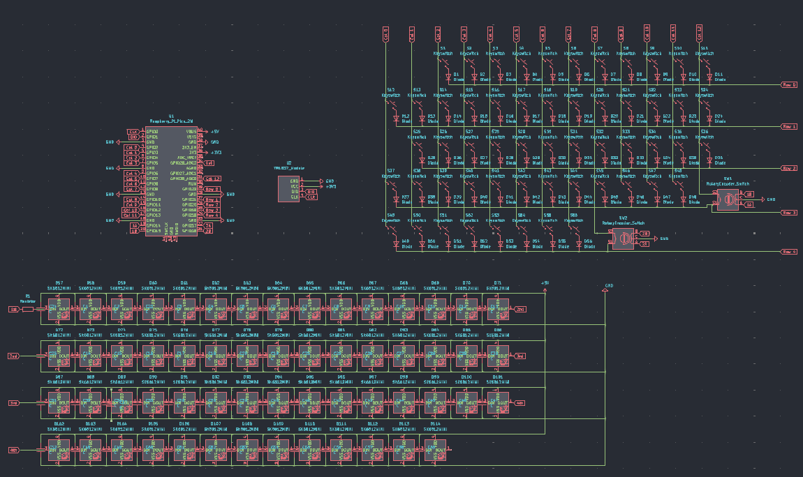

I had to make a custom footprint for the TM1637 Display - to be honest, I really just made a square and added four pads so I can just have the display angled slightly upwards in the actual case.

My custom footprint for the TM1637 Display (not very exact):

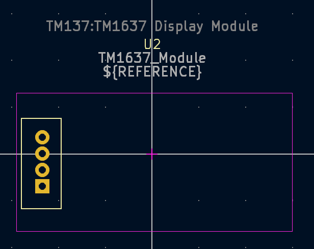

So far, I've arranged up all my keys in the PCB, but I'm still not too sure what to do with the neopixels and the decoupling capacitors. I've posted for help on Slack and I'm awaiting a response.

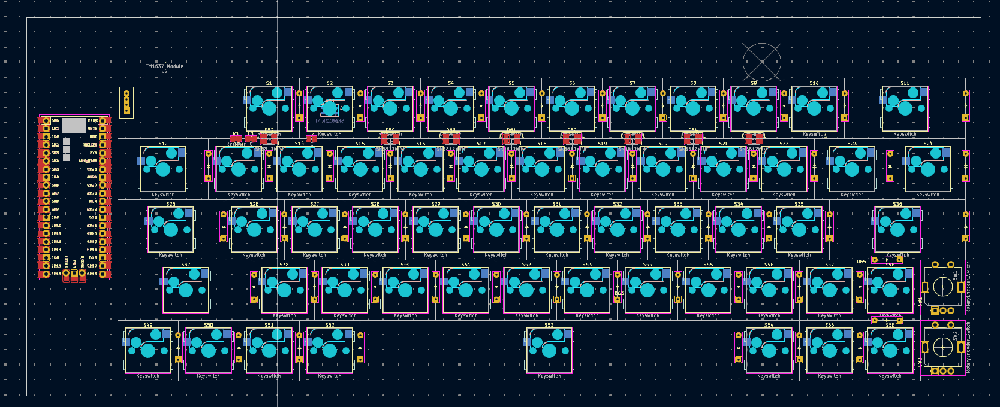

**Total time spent:** 4.25h

## 11th of June:
After not being able to work on the project yesterday (as I was waiting for responses on several things I was confused about); I was able to place the neopixels on my PCB today; aside from that, I just have the capacitors left. However, as I've decided to keep my keyboard wired, since making it wireless is definitely not something a beginner new to keyboard PCB design should do (first thing I saw on the Keyboard Atelier discord), I don't really have to worry about capacitors as the current will be moderated by the computer I plug it into. On top of that, I also removed the two extra neopixels I'd thought could be used for the two rotary encoders (unfortunately, there is no space in or around them to put the neopixels). My updated schematic now looks like:

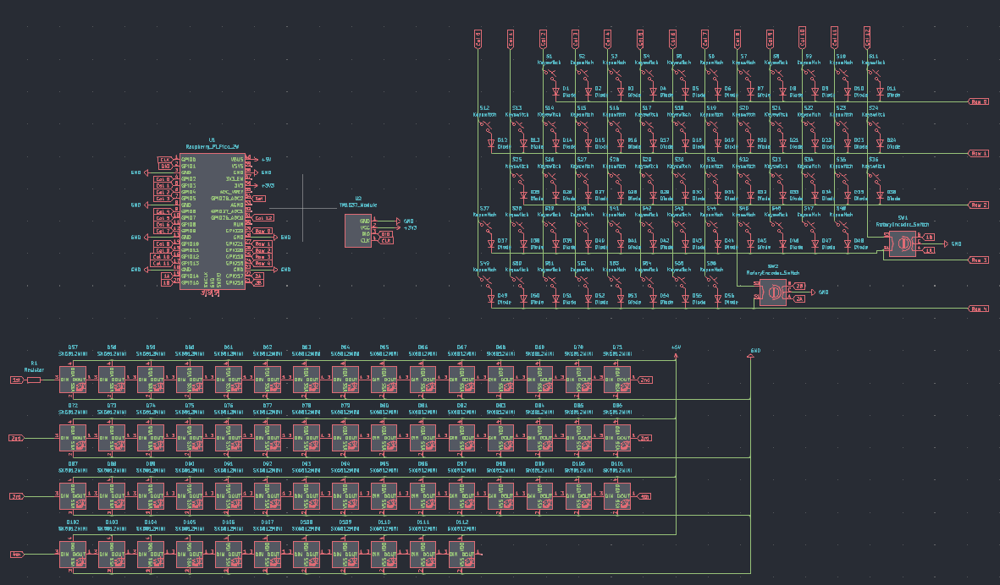

For some reason the 3D models also don't seem to be loading - I have to go in to the footprint editor for each of the keyswitches and add in the model every single time and most of the time it just doesn't seem to save, let alone show in the 3D viewer. 

Ok. So I've finally managed to assign a 3D model to all of the switches and they all show in the 3D viewer, which will be great for when I design the case. Currently, the 3D view for my PCB looks something like this:

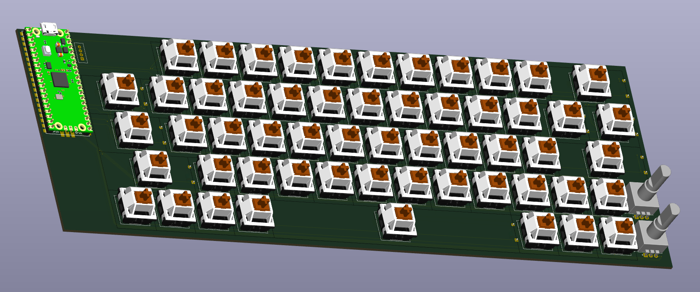

I also managed to wire together a good chunk of my PCB, but I'm running into another problem - its getting too messy and I still have most of the neopixels to wire up. 

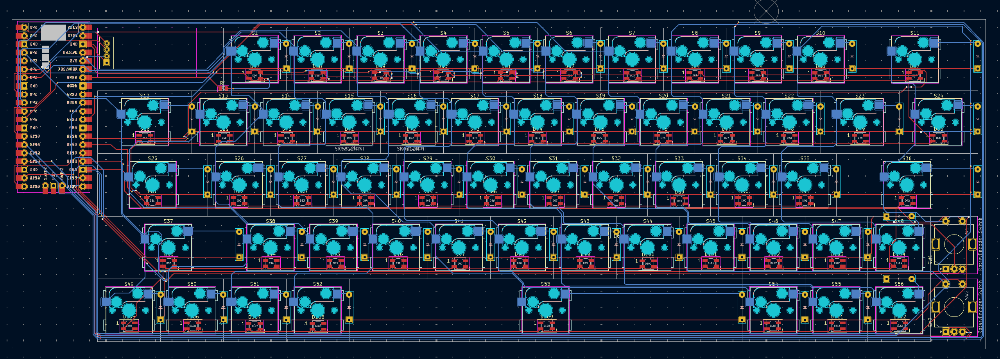

That's it for today, but tomorrow I think I might have to look at ways to improve my traces so that I can actual route all the components without having to use a TON of vias.

**Total time spent:** 3.25h

## 15th of June:
I finally managed to finish the massive tasks of re-routing my PCB and using zone fills on the GND and 5V+ pins to make sure all components were connected. Even though my PCB is *really* messy and a good amount of vias, I was happy that everything was connected. I put up a screenshot of my completed PCB in #electronics on Slack for a review before I move on to designing a case; and I'm currently awaiting responses to some of my questions on that thread. Once I'm done and have some spare time left, I want to add a silkscreen design in the space on the bottom left (under the Pico).

Current PCB progress:

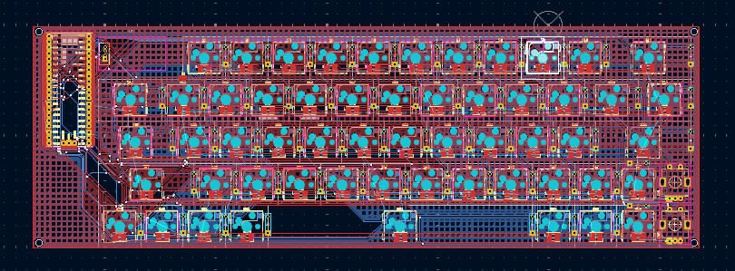

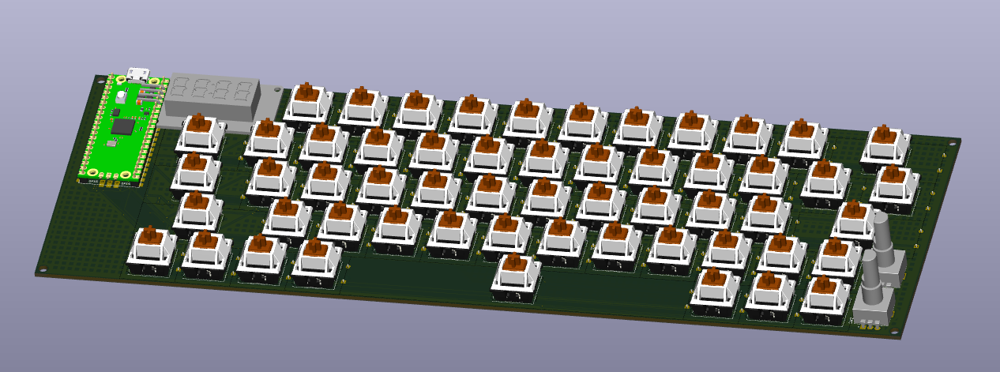

Apart from that, there are a few other problems I need to tackle, including:

- The TM1637 module will exceed the space I've alloted it on the PCB (the actualy display itself isn't that big, but the IC surrounding it is)

- About 4 of my keys need stabilisers and I need to account for them somehow.

While I haven't exactly started my case yet (I want to do a few concept sketches first), I uses the JSON data from KLE and put it into ai03's plate generator so I could at least have the plate ready and customised for the other parts on the PCB (encoders, TM1637). Here's what I've gotten in OnShape so far:

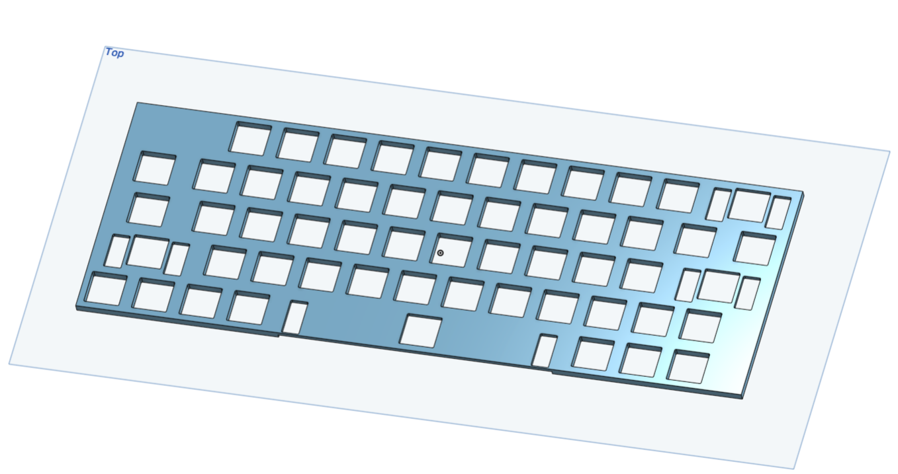

Thankfully, the plate generator added in slots for the stabilisers to go in and after watching Joe Scotto's video on designing mechanical keyboard cases; I adjusted the extrusion for these stabiliser holes in order to ensure that the stabilisers would fit when mounted onto the plate.

**Total time spent:** 3.5h